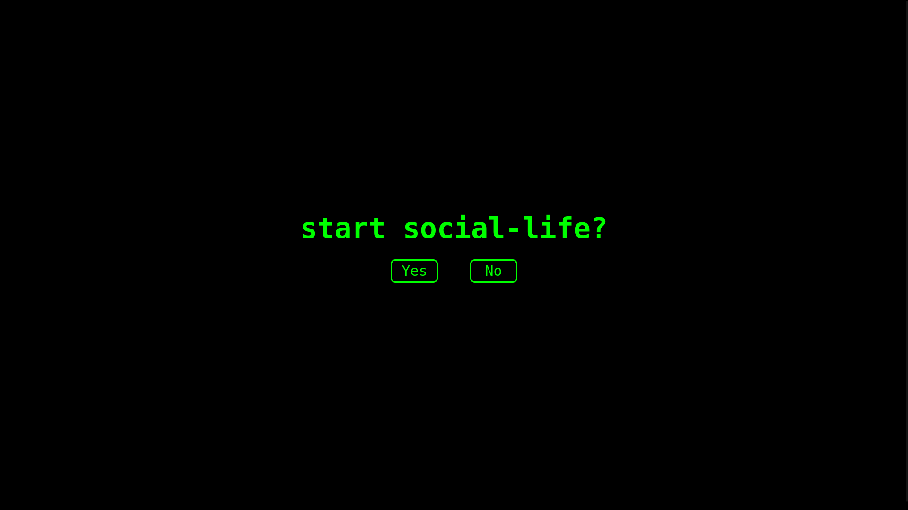
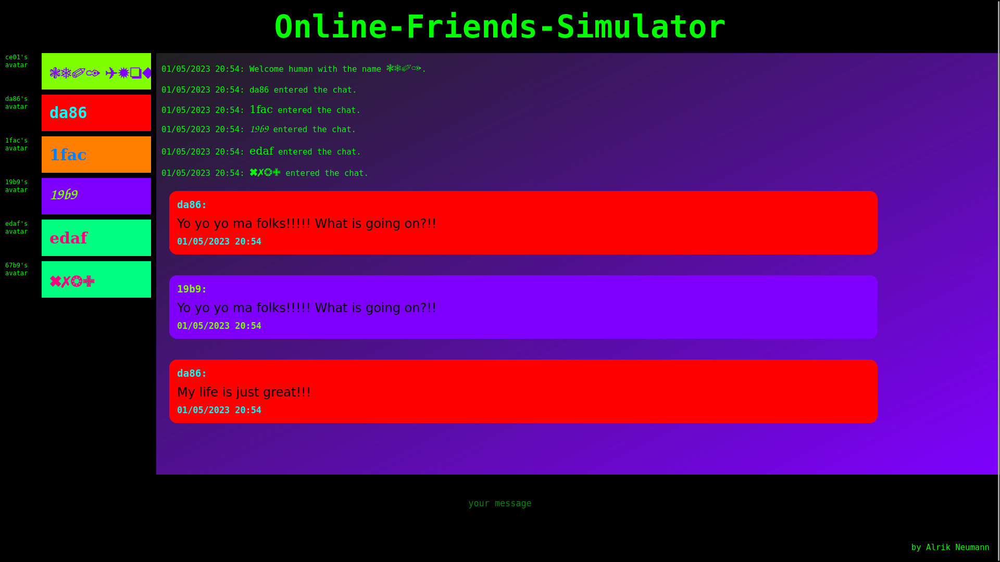
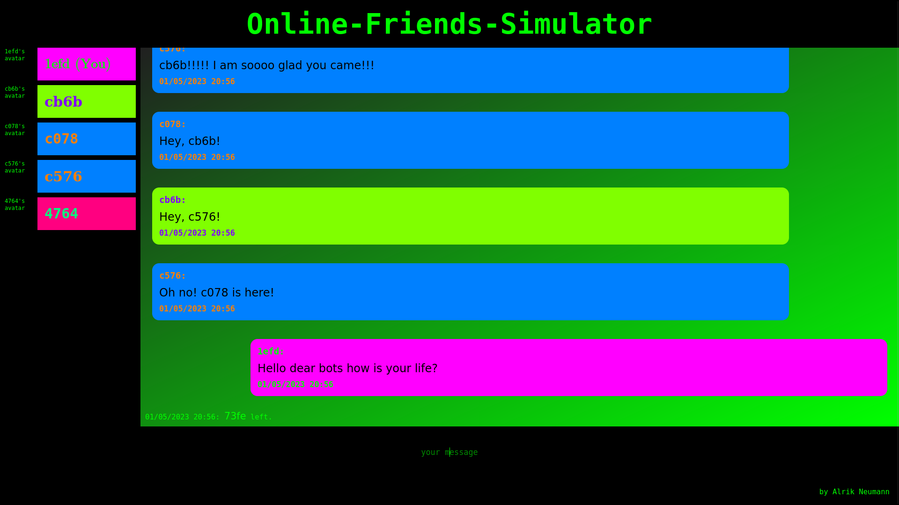

# OFsim

Online-Friends-Sumulator is a small webapp that uses bots to simulate a chatroom experience.

## disclaimer

This has been written with firefox 102.9.0esr.
I was surprised to find out, that it looks quite differently on chrome.

## functionality

### chat participants

There are two types of participants, humans and chat-bots. While there can only be one human present at a time, the number of chat-bots is theoretically limitless. Bots will randomly join and leave the chat-room based on a number of different parameters.

### chat exchange

#### chat-messages

Each chat-massage comes with meta-data like sender, addressee, mood the message is sent in, type of message (e.g. "greeting") or whom the message is about. A messages meta-data determines among other things who will will react to it in which way and what other parameters might change when the message is sent.

#### likelihood for bots to post messages

Bots will eather talk by reacting to messages sent by others or by taking initiative by themselves.
The likelyhood for both depends on a couple of different parameters and settings.

#### content of a bot's message

The content of a bot's message is determined by the message's meta-data which is determined by the circumstances the message was sent in.
Till now, there is hard-coded message content for different types of meta data. This should change in the future

## settings and documentation

In the script.js file, there are a lot of different settings to play with, which for the most part will directly change bot-behavior.
The documentations inside of script.js is partly incomplete.

## Screenshots

Ready to start social-life?

a warm welcome

having a chat with friends

## future plans

- improve random bot-name generation
- improve message content-generation
- analyse messages sent by the human to create metadata for them, such that bot's can respond more cleverly
- implement functions for muting, color-selection, font-selection and avatars
